**Which animals can we see in Kenya**

**Kenya Safari Animals**

Kenya has a magnificent collection of wildlife protected in national parks and reserves across the country. See below a list of animals you can see during a Kenya Safari including close to one hundred mammals and over 400 species of birds which can be seen in places such as Masai Mara, Lake Nakuru, Amboseli, Tsavo, Samburu and Ol Pejeta Conservancy.

**Big Five Animals List**

Many tourists ask what does the Big Five list of animals mean, as they hear about it while planning their Safari to Kenya. Well this is a traditional Kenyan classification of five wild animals which are on most people's wish list, namely the Lion, Elephant, Rhino, Leopard and Buffalo. We have listed brief details on each of these animals below.

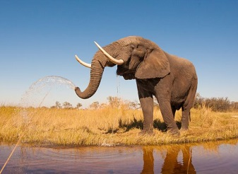

**Elephant（非洲象）( Loxodonta Africana )**
非洲最大陆生动物，群居温顺。

African Elephants are the world's largest land animals, weighing up to (6.6 tons). They are one of the most unique-looking animals, too. With their characteristic long noses, or trunks; large, floppy ears; and wide, thick legs, there is no other animal with a similar physique. The African Elephant is an intelligent, sociable and familial animal, and despite the threat it attracts due to its Ivory, the great news is that numbers are up in Kenya over the last couple of years. They are found in large numbers in Amboseli and Masai Mara among other parks and reserves in Kenya. Read more about the African Elephant here.

**African Buffalo（非洲水牛）( Syncerus caffer )**
性情暴躁，群体防御力强。

African Bufallo is one of the ´´Big Five´´ and is often referred to as one the most dangerous animals in Africa. There are four subspecies of African Bufallo and Cape Bufallo is the most common of the four. They’re distinguished by coloring, size, and even horn shape. There’s also the forest buffalo, the West Africa savanna buffalo, and the Central Africa savanna buffalo. Buffalo are often pictured covered in mud with a bird on their back. The mud helps buffalo get rid of ticks and parasites that hasp onto their skin. Both Male and Female Bufallo has large horns which they use as weapon and for defense. African Bufallos have excellent eyesight, hearing, and a sense of smell that helps them detect the presence of lions, their greatest enemies. They communicate mostly through ritualized body movements and postures. These animals appears in great numbers in all major parks in Kenya, with the exception of Nairobi National Park.

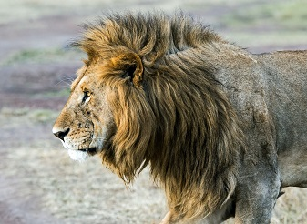

**Lion（狮子）( Panthera Leo)**
群居顶级捕食者，雌狮主攻。

Lions are the largest of Africa's big cats and the only cats that live in groups, which are called prides. It is estimated that there are close to 2,000 in Kenya's National Reserves and Parks. In Masai Mara National Reserve and surrounding conservancies that border the reserve the estimated number of lion population is close to 850 to 900. The 'Mara' as it is also known is generally considered one of the best places in Kenya and East Africa to see these magnificent animals in the wild on a Safari. Individual Lions (males) can hold huge territories ranging from 30 to 400 square kilometers. The lionesses (females) take the lead when it comes to hunting down the prey. From time to time the Males will assist with a hunt. Read more about [Masai Mara Lions](https://www.masaimara.travel/lions-masai-mara.php) in detail at this page.

**Leopard（非洲豹）(Panthera pardus )**
独居善爬树，夜间捕猎。

The Leopard (Panthera Pardus) is counted as one of the Big Cats and is one of the five species in the genus Panthera. Its distinguished by its well-camouflaged fur, opportunistic hunting behaviour, broad diet, strength, and its ability to adapt to a variety of habitats ranging from rainforest to steppe, including arid and montane areas. Leopards are spectacular hunters, famous for their incredible agility and strength to climb trees while dragging a kill that is sometimes heavier than their body weight and they can run at speeds of up to 58 kilometres per hour. Though Leopards can be found in healthy numbers in some the major parks in Kenya, these elusive animals are nonetheless listed as vulnerable on the IUCN Red List because leopard populations are threatened by human encroachment and habitat loss. Leopards almost always hunt on their own and are by nature 'shy', preferring to hunt at night.

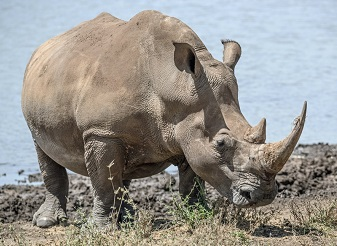

**Rhino（犀牛）( Rhinocerotidae )**
厚皮有角，受盗猎威胁。

Rhino is one of the five extant species of odd-toed ungulates in the family Rhinocerotidae, as well as any of the numerous extinct species. Black Rhinos which are found in large numbers in Ol Pejeta and Lewa Conservancy as well as other parks are smaller than the white rhinos commonly found at Lake Nakuru. Black Rhino are also more aggresive species compared to White Rhino, and they use their horns during mating and fighting, as well as when defending themselves from predators. They also use their hooked lip to browse shrubs and prefer thick bush habitat.

**The Big Nine Animal List in Kenya**

The Big 9 are essentially the Big Five animals above with the addition of the Cheetah, Giraffe, Zebra and Hippopotamus. Masai Mara is one of the few places in Kenya and East Africa where all of the Big Nine wildlife may be spotted on single game drive of 2 to 3 hours.

**Cheetah（猎豹）( Acinonyx Jubantus )**
陆地速度最快，日间猎手。

The cheetah is the world's fastest land mammal, capable of running at 80 to 128 km/h, and as such has several adaptations for speed, including a light build, long thin legs and a long tail. They are mainly active during the day and hunting is the major activity, with peaks during dawn and dusk. Similar in appearance to the leopards, the Cheetah is longer and lighter in the body. It has a slightly bowed back and a much smaller and rounder face. It stands around 80cm at the shoulder, measures around 210cm in length (including the tail) and weighs anything from 40 to 60kg. It's found in small numbers in all of Kenya's major game reserves.

**Giraffe（长颈鹿）( Giraffa )**
世界最高哺乳动物，食树叶。

Giraffe ( Giraffa) is an African artiodactyl mammal, the tallest living terrestrial animal and the largest ruminant. They are known for their graceful movements even when running at their fastest speed of 50 to 60 km per hour. The giraffe's chief distinguishing characteristics are its extremely long neck and legs, its horn-like ossicones, and its distinctive coat patterns. There are two main sub species of Giraffe found in Kenya, the Reticulated or Somali Giraffe in Northern Kenya, and the Maasai Giraffe in southern Kenya including Masai Mara. It is estimated that close to 33,000 Maasai giraffe are alive in the wild in Kenya.

**Hippo（河马）( Hippopotamus amphibius )**
水栖体型大，夜间上岸取食。

The Hippopotamus are large, round, water-loving animals that are native to Africa. They are commonly referred to as Hippo and are the third largest land mammal with the average adult males weighing in at close to 1500 kilos. Hippos typically inhabit swamps, rivers, and areas close to the lake shore, and remain cool by staying in the water during most of the day. They are found in greatest numbers in Lake Nakuru National Park and other major parks such as Masai Mara National Game Reserve, Amboseli, Nairobi and Tsavo National Parks as well as Lake Baringo.

**Zebra（斑马）( Equus quagga )**
群居草食，黑白条纹识别。

Zebras are single-hoofed animals native to Africa. They are generally social animals that live in small harems to large herds. There are three species of zebras: the plains zebra, the mountain zebra and the Grévy's zebra. Masai Mara is home to the plains Zebra while the Grevy's Zebra with their unique thinner stripes are found in Samburu Reserve, Northern Kenya. Grévy's zebra and the mountain zebra are endangered. While plains zebras are much more plentiful.

**Full list of Animals**

East Africa and specifically Kenya has a rich bio diversity which means there are a large number of mammal species to be found in the country's national parks and wildlife reserves as well as conservancies. Below is a list of most of the diverse wildlife you will find in Kenya, starting with a list of Mammals below.

**Aardvak（土豚）( Orycteropus afer )**
夜行掘食蚂蚁白蚁。

The Aardvarks are nocturnal animals that feed on insects, mainly ants and termites and they chew with their stomach. They are small to medium sized burrowing mammals with a long snout and powerful claws, native to Africa. They have a hairless body with a pronounced arched back and short legs. The thick claws on the forefeet are well adapted for burrowing and digging.

**Aardwolf（土狼）( Proteles cristatus )**
食蚁性犬科，夜行胆小。

Aardwolf is an insectivorous carnivore, yellowish in colour with vertical black stripes and a bushy black-tipped tail and resembles a small striped hyena. The shy, mainly nocturnal aardwolf lives on the arid plains of Africa. It has a long coarse ridge of erectile hairs along the length of the back, sturdy shoulders, and longer front than hind legs. However, Aardwolf is less of a runner and has five toes on the front feet instead of four. They are solitary and they rest in burrows during the day before becoming active at night. Their territory is between 1 and 4 square kilometres, depending on food availability, and they mark it with urine, dung and secretions from their anal glands.

**African Hare（非洲野兔）( Lepus capensis )**
夜行善奔，依靠伪装脱险。

African hares is nocturnal medium-sized mammal species in the family Leporidae, native to Africa. They live mainly solitary lives, though they sometimes form groups of two or three when eating and use their senses of hearing, smell, and sight to avoid predators. They rely on camouflage to stay hidden, but can run at up to 70 kilometres (43 mi) an hour and sometimes leap vigorously sideways to break the scent trail they are leaving. African hares are 20 inches long, weighs between 1.5 to 3 kilograms (3.3 to 6.6 lb) and feeds on leaves, buds, roots, berries, fungi, bark and twigs. The life span of the African hare is 12 years.

**African Wild Dogs（非洲野犬）( Lycaon pictus lupinus )**
群猎协作高效，极濒危。

The East African wild dog is a subspecies of African wild dog native to East Africa. It is distinguished from the nominate Cape subspecies by its smaller size and much blacker coat. The wild dogs have only four toes per foot, whereas our domestic dogs have five on their forefeet. And even with this missing digit, they can reach speeds between 40 and 50 miles per hour. The African Wild Dogs are listed as endangered species, mainly due to habitat loss and disease. In Kenya the populations in the wild are estimated to be between just three and five thousand. Laikipia- Samburu ecosystem is home to the largest population of wild dogs resident within Kenya, and the sixth largest wild dog population in the world! The largest populations are in Southern Tanzania, particularly in Nyerere National Park. Read more about [Animals in Nyerere National Park](https://www.nyererenationalpark.net/animals-wildlife-nyerere-selous.php) in detail at this page.

**Antelope（羚羊）( Alcelaphinae )**
角常不脱落，多样化草食者。

Antelope is a deer-like mammal found in Africa, and can be found in a wide range of habitats, typically woodland, forest, savannah, grassland plains, and marshes. Unlike deer that renew their horns annually, the antelope has strong permanent horns, that come in a variety of sizes and show true diversity and imagination with their head gear. They’re the unsung beauties of the bush and the grassland. They also use their horns to defend their herd or to fight other antelopes. There are 3 sub species, namely the Kirk's Dik-Dik, klipspringer, and Oribi Antelope.These animals can be found in large numbers in major of the National parks and Reserves in Kenya.

**Banded Mongoose（条纹獴）( Mungos mungo )**
群居小型食肉，善捕蛇。

Banded mongooses are small, catlike carnivores native to Africa. They are characterised by triangular shaped, pointed faces and flat broad ears. They are about 12-18 inches (30-45 centimeters) long with a 6-12 inch (15-30 centimeter) long tail. They weigh 3-5.5 pounds (1.5-2.5 kilograms). They are brown or grey in colour and are easily identifiable by the dark bands across the back which stretch from shoulder to the tail. They are commonly seen in groups in Tsavo, Amboseli and Masai Mara reserves. They are famous for their ability to kill snakes and are one of the most social mongoose species, living in packs of up to 20. They have developed a vocabulary of calls to communicate with each other, as well as anal and cheek glands to scent-mark their territory.

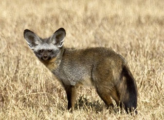

**Bat Eared Fox（大耳狐）( Otocyon magalotis )**
巨耳散热，主食白蚁。

Bat eared fox is a nocturnal animal species belonging to the dog family. Commonly found in open, arid areas of eastern and southern Africa. It is yellowish grey with black face and legs and black-tipped ears and tail. Their large, bushy tails work as a rudder when fleeing from predators in a zig-zag pattern. They are highly social so if you spot one, keep your eye out for more. They feed mostly on small invertebrates such as ants, termites, spiders, scorpions and crickets. They will also eat small birds, mammals and reptiles, and even desert truffle.

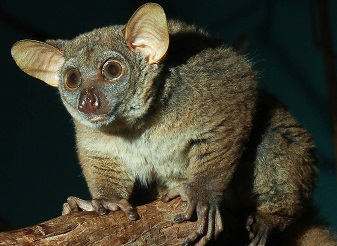

**Bushbaby（婴猴）( Galago senegalensis )**
夜行树栖，跳跃力强。

Bushbaby also called Galagos are small, nocturnal animals that spend most of their lives on the tress. They are gray, brown, or reddish to yellowish brown, with large eyes and ears, long hind legs, soft, woolly fur, and long tails. They have strong back legs that enable them to jump more than 5-6 feet in a vertical direction. They are agile, speedy climbers and their long tails give them added balance. They feed on fruits, insects, and even small birds, but a major component of the diet of most species is gum that oozes out of certain tree species.

**Bushbuck（灌丛羚）( Tragelaphus scriptus )**
雄性具角，斑纹隐蔽。

Bushbuck are the most common and widespread kind of African antelopes. The bushbucks have a light brown coat, with up to seven white stripes and white splotches on the sides. The muzzle is also white and horns are found only on the males and they can reach over half a meter with only one twist. They are solitary creatures that communicate mainly through scent-marking. They mainly browse, but supplement their diet with any other plant matter that they can reach. Bushbucks are active around 24 hours a day, but tend to be nocturnal near human habitations.

**Chimpanzee（黑猩猩）( Pan troglodytes )**
社群复杂，工具使用者。

The chimpanzee also called robust chimpanzee, or simply "chimp", are our closest cousins, we share about 98% of our genes. They are covered by a coat of brown or black hair, but their faces are bare except for a short white beard. Skin colour is generally white except for the face, hands, and feet, which are black. The faces of younger animals may be pinkish or whitish. Chimpanzees are highly social, intelligent, curious and noisy. They live in groups that range in size from 15 to 150 members, although individuals travel and forage in much smaller groups during the day. They exhibit complex patterns of behavior, many of which are learned, and can solve problems, plan for anticipated events, as well as make and use tools. They have even been seen utilizing medicinal plants for a variety of ailments. The chimpanzees are listed on the IUCN Red List as an endangered species; habitat loss, poaching, and disease being their biggest threats. They exits in large numbers in Ol Pejeta Chimpanzee Santuary, Kenya.

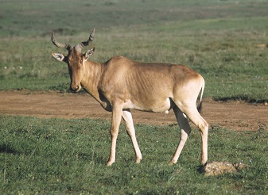

**Coke's Hartebeest（可氏大羚）( Alcelaphus buselaphus cokii )**
长脸短角，奔跑持久。

The Coke's Hartebeest is a medium-sized, fawn-colored antelope native to Kenya and Tanzania. It is easy to recognise as it has long, narrow face and distinctively angular short horns (on both sexes) which are heavily ridged. It is one of the fastest antelopes and most enduring runners. They are mainly found in medium and tall grasslands, including savannas. They can be easily spotted in Nairobi and Tsavo East National Park, Tsavo West and Amboseli National Park, and Masai Mara National Reserve. The hartebeest feeds almost entirely on grass, but is not very selective and quite tolerant of poor-quality food.

**Common Eland（大角羚）( Tragelaphus (Taurotragus) oryx )**
非洲最大羚羊之一，食草树叶。

Common eland is one of the largest spiral-horned antelope and the second largest antelope in the world, being slightly smaller on average than the giant eland. They prefers savannah scrub to wide open spaces, but also avoids thick forest. Common Elands feeds on grass and tree foliage in the early morning and late afternoon, and are also active on moonlit nights. They are easily seen in Nairobi and Tsavo East National Park, Tsavo West National Park and Masai Mara National Reserve.

**Copper Tailed Monkey/ Red Tailed Monkey（赤尾猴）( Cercopithecus ascanius )**
群居灵长，尾下赤色明显。

Red Tailed Monkeys are named for their red coloration of the tail's underside as well as the bi-coloration of the tail as the reddish color increases from the base to the tip. They are social primates that form groups of 7-30 individuals. The groups consist of one dominant male and females and their offspring. Groups generally stay together throughout the day and through life, except for males who reach maturity. Red-tailed monkeys are more active in the early morning and evening. They communicate physically, vocally, visually and also demonstrate social dominance, submissiveness, or greeting. They are omnivorous and feed on fruits but also eat leaves, flowers, or insects in times where fruit is scarce.

**Crested Porcupine（冠豪猪）( Hystrix cristata )**
体覆硬刺，受惊会立冠。

The African Crested Porcupine is one of the largest rodents in the world, weighing up to 30kg. It is a very large, black-bodied, nocturnal rodent with long, black and white spines and a prominent crest of elongated, spiny hairs from forehead to shoulders. It can be distinguished from others by its black rump and short, rattle-like quills in the tail. The solid and sharp quills, covering the body of this animal, serve as a mean of self-defense against predators. Crested porcupine are mostly seen in non-desert habitat in savannas, woodlands, steppes and uplands. They eat mostly plant material: fruits, roots, tubers, bulbs, and bark.

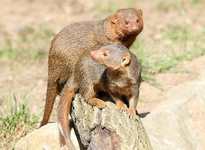

**Dwarf Mongoose（侏獴）( Helpgale parvula )**
体型最小的獴，群居合作。

Dwarf mongoose is the smallest of the mongoose family, and both males and females weigh only 350-400gr. They are one of the two social species of mongoose, living in family groups of between 2 and 21 individuals with more female than male and fluctuating numbers of young ones. They are territorial, and each group uses an area of approximately 30-60 hectares (depending on the type of habitat). They feed on insects, notably crickets and grasshoppers, termites, scorpions and spiders. They prefer dry woodland savannahs. The gestation period lasts for 53 days and 1-6 young ones are born.

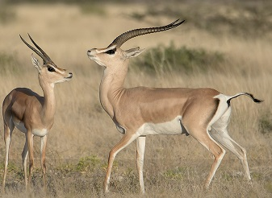

**Grant's Gazelle（格兰特瞪羚）( Gazella granti )**
长角优雅，草原常见。

Grant's gazelle is a species of gazelle found in Kenya,Tanzania, Ethiopia and Sudan. It bears a resemblance to the Thompson’s gazelle, except its horns are more lyre shaped and ringed. They are easily identified by their coloring and long horns. They are sandy brown on the back, clearly demarcated from a lighter colour on the flanks and white belly, and white around the tail and hind legs. Horns are found on both sexes. These gazelles are often found in mixed groups alongside other herbivores. e.g. Wildebeest, Zebras and Thomson’s Gazelle. They may occur in large numbers (up to 500 individuals) in suitable areas. They exist in large numbers in Nairobi National park, Amboseli, Masai Mara, Tsavo and Marsabit National Reserve.

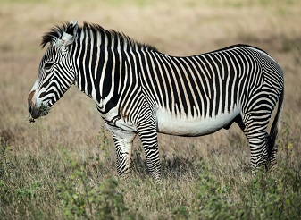

**Grevy's Zebra（格氏斑马）( Equus grevyi )**
耳大条纹细，极危物种。

The Grévy's zebra is the largest living wild equid- weighing between 350-450 kgs, and the most threatened of the three species of zebra, the other two being the plains zebra and the mountain zebra. It is distinguished by its unique stripes, which are as distinctive as human fingerprints. Foals are brown with reddish-brown stripes, and gradually their coats darken to black. The grevy’s Zebra are taller, have larger ears, and have narrower stripes than plains zebras. They exist in large number in Samburu National Park.

**Honey Badger（蜜獾）( Mellivora capensis )**
性格凶悍，敢斗猛兽。

Honey badger, its proper name is Ratel, although they get their name from their fondness for feeding on honey and honeybee larvae. They also eat insects, amphibians, reptiles, birds, and mammals, as well as roots, bulbs, berries, and fruits. Honey badgers hunt by locating their victims with their acute sense of smell. They will then dig with their razor-sharp claws to extract their prey. As nocturnal creatures, honey badgers very secretive and difficult to observe in the wilderness. They are often seen alone, though it’s not uncommon to spot mating pairs. They are notorious for their pugnacious and fearless personality, and have been known to take on animals many times their own size. They live mainly in dry areas but are also found in forests and grasslands. Honey badgers are good swimmers and can climb trees.

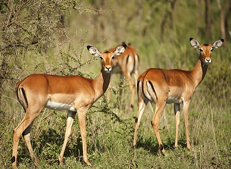

**Impala（黑斑羚）( Aepyceros melampus )**
灵活跳跃，边林近水活动。

Impala is a medium-sized antelope, reddish-brown in colour with white hair inside the ears, over each eye and on the chin, upper throat, underparts and buttocks. A narrow black line runs along the middle of the lower back to the tail, and a vertical black stripe appears on the back of each thigh. Impalas are found at grassland and woodland edges, usually very close by water. They are both graze and browse and eats young grass shoots in the wet season and herbs and shrubs at other times. Best places to find impalas in Kenya includes; Masai Mara National Reserve, Kisumu Impala santuary, Hell's Gate, Nairobi and Lake Nakuru National Parks.

**Kirk's Dik Dik（柯氏狄克迪克）( Madoqua kirkii )**
体型娇小，常成对活动。

Kirk's dik-dik is a tiny antelope, reddish-brown colour on the back, with lighter flanks and white belly. They are easily recognised by almost lack of a tail and the tuft of dark hair on the forehead. Horns are found only on males and are so short that they are often lost in the hair tuft. Dik-diks are highly nocturnal, and during the daytime seek shade to rest throughout the hottest parts of the day to help avoid the loss of valuable fluids. The Kirk's dik dik is the most common of the two dik-diks found in Kenya and is easily seen in Nairobi, Tsavo East and West and Amboseli National Park as well as Masai Mara National Reserve.

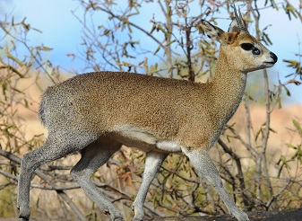

**Klipspringer（岩跳羚）( Oreotragus oreotragus )**
蹄端如指，岩地跳跃自如。

Klipspringer is a small, sturdy antelope; standing about 50cm at the shoulder. The name Klipspringer is the Afrikaans for 'rock jumper' and imply to the animal's ability in rocky territory where it can be seen moving freely, seemingly on tiptoe. They are easily recognised by their curious 'tip-toe' stance and the greenish tinge of their speckled coarse hair. Their horns are short and widely spaced. Klipspringer are most often seen on rocky outcrops, or in the grassland in the immediate vicinity, and when alarmed they retreat into the rocks for safety.Best places to find klipspringers in Kenya includes; Masai Mara National Reserve, Amboseli and Meru National Park as well as Tsavo East and Tsavo West National Park.

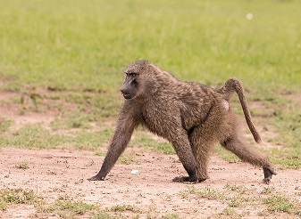

**Olive Baboons（橄榄狒狒）( Papio cynocephalus anubis )**
适应力强，食性杂。

Olive Baboon also known as the Anubis Baboon, have a greenish-grey coat that covers its bodies and a black face. The individual hairs are green-grey with rings of black and yellowish-brown, giving the coat a multi-color appearance from up-close. Males and females are sexually dimorphic, with the males being about twice as large as female.They live in troops of males and females that consist of between 20 and 50 members, but sometimes these troops can consist of over 100 baboons. They feed on grass, seeds, leaves, cereals, fruit, tubers, small mammals, invertebrates and young birds. They inhabit savannahs, steppes and forests and are very adaptable.

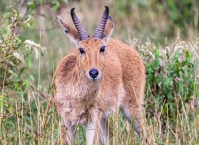

**Oribi（奥里比）( Ourebia ourebi )**
小型细角羚，偏好短草地。

Oribi is a small delicate antelope found in Africa. It has slender build and is long-limbed and long-necked. It stands 51–76 cm high and weighs about 14 kg (31 pounds); females are slightly larger than males. It has prominent ears, and the males have erect, spikelike horns 8–19 cm long. The glossy, yellowish to rufous brown coat contrasts with the white chin, throat, underparts and rump. The bushy tail is brown to black on the outside with white insides. They are commonly found in grasslands maintained by fire or heavy grazing. Oribi prefers flats or gentle slopes and is commonest on open lawns of grass kept short by compaction, poor soils. They are relatively uncommon, but can be spotted in some of the Kenya's major Parks and reserves.

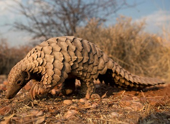

**Pangolin（穿山甲）( Manis temminckii )**
全身鳞片，卷曲自保。

Pangolins are bizarre-looking, nocturnal mammals covered in protective keratin scales. They are the only known mammals with this feature. When threatened, they roll up into a ball to protect themselves. They live in hollow trees or burrows, depending on the species. Pangolins diet consists of mainly ants and termites, which they capture using their long tongues. They tend to be solitary animals, meeting only to mate and produce a litter of one to three offspring, which are raised for about two years. Although they are one of Africa’s most elusive creatures and rarely seen, pangolins can be spotted in Masai Mara National Reserve.

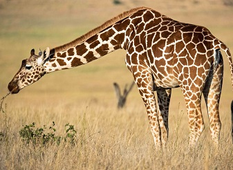

**Reticulated Giraffe（网纹长颈鹿）( Giraffa camelopardalis reticulata )**
白网状花纹，北肯尼亚常见。

The Reticulated Giraffe or Somali Giraffe is a subspecies of giraffe native to Somali, and they are widely found in Northern Kenya. It is estimated that there are 8,500 to 9,000 Reticulated Giraffes living in the wild. Reticulated Giraffe coat consists of large, polygonal, liver-colored spots outlined by a network of bright-white lines. The blocks may sometimes appear deep red and may also cover the legs. Male Reticulated Giraffes reach a towering 18 feet tall and weigh between 2400 and 4250 pounds, while the female Reticulated Giraffes measure up to 17 feet tall and weigh between 1540 and 2600 pounds. They are also fast and are able to gallop up to 56 kilometres per hour.

**Side Striped Jackal（侧纹胡狼）( Canis adustus )**
体侧淡纹，杂食夜行。

Side striped jackal is a nocturnal, dog-like carnivore, shorter legged and shorter eared than other Jackals, it can be easily identified by the white tip to its tail and by the poorly defined black and white stripes along the flanks. This jackal species tends to be heavily built and is sexually dimorphic in size, males are a bit larger than females. Males range from 7.3 to 12 kg, whereas females are rarely known to weigh more than 10 kg. They mostly feed on invertebrates and small vertebrates eg; fish and gazelle fawns as well as fallen fruits, unripe maize, carrion and organic rubbish.

**Slender Mongoose（纤细獴）( Herpestes sanguineus )**
体形修长，食昆虫与小兽。

Slender mongoose is a very common species of mongoose of sub-Saharan Africa. The color of their fur varies widely between subspecies, from a dark reddish-brown to an orange-red, grey, or even yellow. However, these mongooses can be distinguished from other mongooses due to the prominent black or red tip on their tails. The digits of the hands and feet splay readily and are armed with small but sharp color. They are found in all wooden, Savannah, thicket and forest habitats and forest swamps. Slender mongoose feeds on rodents, insects, reptiles, frogs and birds.

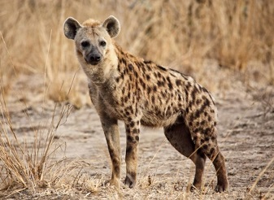

**Spotted Hyena（斑鬣狗）( Hyaena hyaena )**
社群母系，兼猎兼食腐。

Spotted hyenas are famous for scavengers and often eat on the leftovers of other predators. They are also skilled hunters and can take down wildebeest or antelope. They also kill and eat birds, lizards, snakes, and insects. Spotted Hyenas are the largest of the three hyena species. The other two are brown and striped hyenas. Spotted hyenas live together in large groups called clans that may include up 80 individuals and are led by females. In contrast to most other female mammals, the female hyena are male-like in appearance, larger than males, and substantially more aggressive this is beacuse of their social structure and an increase in testosterone in its fetal stages. Female hyenas are highly social and dominate the male hyenas, with the largest group sizes and most complex social behaviors. Spotted hyenas have good hearing and sharp eyesight at night. They are fast and can run for long distances without tiring.

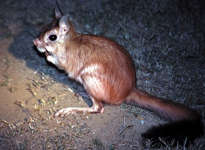

**Spring Hare（跳兔）( Pedetes capensis )**
后足发达，夜行啮齿类。

Spring Hare is a peculiar looking nocturnal species of rodent that is commonly found in the south of Zaire and Kenya as well as South Africa. The head and body of the Spring Hare measures 400mm with a tail of 440 mm. It is covered with thick hairs that form a dark brown or black brush at the tip. The fur is straight, long, soft, and thin, ranging in colour from sandy to reddish brown. It has short forelegs but long, powerful hind legs and feet used for jumping. Found locally in the semiarid steppes and dry savannas of Kenya. Spring hare feeds on fresh grasses, grazed to the ground stems, roots and storage bases of grasses, new sprouts of herbs and fruits. They sometimes eat insects, such as locusts. They feed only at night and within about 400m of burrow.

**Straw Coloured Fruit Bat（稻色果蝠）( Eidolon helvum )**
大群栖息，主食果实。

Straw coloured fruit bat is a nocturnal species and it gets its name from the yellowish or straw-colored fur around the neck. Their necks and backs are a yellowish-brown colour, while their undersides are tawny olive or brownish. They live in a wide range of habitats across sub-Saharan Africa. They prefers moist and dry tropical forests, because there is so much fruit, although they also eat blossoms and young shoots of silk-cotton trees but will use various other forest habitats and even urban areas. These bats are very strong fliers, with long, pointed wings built for endurance over agility. Because of this, they can’t manoeuvre in tight spaces and find their food in the more open upper canopy layer. They are highly social species and travel in massive colonies of at least 100,000 bats.

**Thomson's Gazelle（汤氏瞪羚）( Gazella thomsonii )**
体型中等，奔跑迅速。

Thomson's gazelles are medium-sized antelopes found in East Africa, in Kenya, Tanzania, and southern Sudan. They have reddish-brown fur on their faces, with a broad white stripe that extends from the eye to the nose and is bordered below by a black stripe. Both Males and females have horns that curve backwards and are curved forwards distally in males. Thomson's gazelles have a head and body length of 80 to 120 cm, a tail length of 15 to 27 cm, and height at the shoulder of 55 to 82 cm. Thomson’s gazelles prefer savannas and grassland habitats, particularly in the Serengeti region of Kenya and Tanzania.

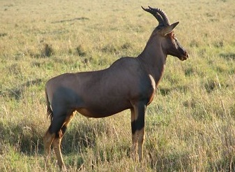

**Topi（托皮羚）(Damaliscus lunatus jimela)**
体色铜红，喜湿草地。

Topi also called tsessebe or sassaby, is one of Africa’s most common and most widespread antelopes. Topi's are medium sized antelopes and range in height from 104 cm - 126 cm in males and 105 cm - 118 cm in females. Their bodies are covered with a striking reddish-brown to purplish-red coat that is glossy, even iridescent in bright sunlight. Their horns are S-shaped, ringed and range in length from 30-40 cm. Primarily lives in flood plains, but they are sometimes found in dry areas of open savanna and park woodland, taking to the shade during the heat of the day. They prefer flat lowlands, and can go without water for long periods of time only if they have access to green pastures. In Kenya, they are mainly found in Masai Mara where they exists in large numbers. Their main predator is lion.

**Vervet Monkey（黑脸长尾猴）( Cercopithecus aethiops )**
群居活跃，常近水域。

Vervet Monkey also called savanna monkey, are the most widespread of the African monkeys and inhabit large parts of sub-Saharan Africa. They can be identified by their yellow to greenish-brown coat of hair. Their bellies are white, and they also have white fur on their brows and cheeks. Vervet society is built on complex but stable social groups (called troops) of 10 to 50 individuals—mainly adult females and their immature offspring. They eats a primarily herbivorous diet, living mostly on Leaves and young shoots- but bark, flowers, fruit, bulbs, roots and grass seeds are also consumed. The mainly vegetarian diet is supplemented with insects, grubs, eggs, baby birds and sometimes rodents and hares.

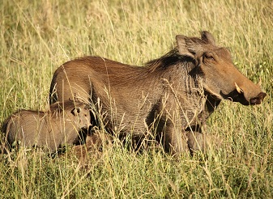

**Warthogs（疣猪）( Phacochoerus africanus )**
奔跑举尾，屈膝取食。

Warthogs are distributed throughout the savannah and semi-arid areas of sub-saharan africa. They are often seen in family groups, with parents and piglets trotting briskly in a straight line with tails erect. Warthogs have the peculiar habit of kneeling on the front knees while feeding and foraging in a localised area. They are herbivores and diurnal animals that spend much of their day foraging for food. Their most endearing habit is the way they turn tail and trot away with their thin tufted tails stuck straight up in the air like some antenna. Best places to see them in Kenya are in the Masai Mara National Reserve, Nairobi and Amboseli National Parks. They are the most common wild pig in Kenya and the most frequently observed wild pig in Africa.

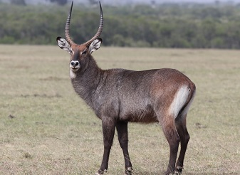

**Waterbuck（水羚）( Kobus ellipsiprymnus )**
雄具环角，近水草地。

Waterbuck is a large antelope found widely in sub-Saharan Africa.It is a fairly solid animal and is easily recognisable by its thick, shaggy, dark brown coat and white inner thighs. The long, spiral horns are present in males only which they use to defend themselves if attacked, and these curve gradually outwards then grow straight up to a length of about 75cm. The female and young ones move in vicinity of a number of territorial males,or may stay with one male. They feed on grass,reeds,and some foliage. It is fairly common and easily seen in Nairobi and Lake Nakuru National Park and Masai Mara National Reserve.

**Wildebeest（角马）( Connochaetes )**
大迁徙主角，群体庞大。

Wildebeest is a member of the antelope family. The front end of its body is heavily built, while the hindquarters are slender with spindly legs, making it look more bovine. Wildebeests have a gray coat and a black mane as well as a beard that can be black or white. They travel in large herds and are active day and night, grazing constantly. The species forming the large herds of the Serengeti-Mara ecosystem of Kenya and Tanzania is known as the western white-bearded wildebeest. Their favourite habitats are open woodlands and open grassy plains. The famous [Wildebeest Migration](https://www.masaimara.travel/wildebeest-migration.php) which occurs across Serengeti and Masai Mara is named after this animals as Wildebeest make up the majority of the migrating herds of animals which trek up north from Serengeti into Masai Mara every July to Septermber.

**Bird List**

Although not the obvious choise of destination for Birding in Kenya, which after all is home to some of the best birding hotspots in the world, Masai Mara is still a very good place for Ornithological tours, with over 500 species recorded, with many of these being raptor species.

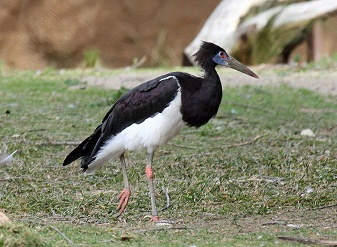

**Abdim's Stork（阿布丁鹳）(Ciconia abdimii)**
体型中等，腹部白色显著。

Abdim's stork is a medium-sized, dark stork with a white belly. It is also called white-bellied stork, and is the smallest of all storks. It has grey long legs, red knees and feet, and a grey bill. It has red facial skin next to the eye and, during the breeding season, it has blue skin near the bill. The plumage is mostly black except for the white underparts. This species is widespread and common throughout its large range and can easily be seen in major National Parks and Reserves in Kenya.

**African Darter（非洲蛇鹈）(Anhinga rufa)**
游泳仅露颈，利喙刺鱼。

The African Darter sometimes called the snakebird, is a water bird of sub-Saharan Africa and Iraq. They are large, slim water birds that measure about 80 cm in length, including their long, rounded tails. These cormorant-like birds often swim with only the neck above water. They have very long and sharp beaks, which they use to spear their slippery fish prey. They are endemic to tropical sub-Saharan Africa, where they are widespread in freshwater wetlands, preferring placid to fast flowing waters. In Kenya you'll mostly find these birds in Lake Baringo and Masai Mara Game Reserve.

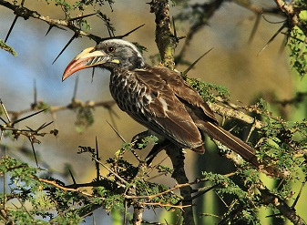

**African Grey Hornbill（非洲灰犀鸟）(Tockus nasutus)**
灰色小型犀鸟，弯喙取食。

African grey hornbill is a medium sized bird, but one of the smaller hornbill species of the hornbill family. The plumage is mostly grey, with the head, wings and tails being a darker shade. The bill is dark, long and curved, with a small casque and cream coloured stripe running along the bill. The female has a red tip to the bill, with the upper mandible being pale yellow in colour. This hornbill is a widespread and common resident breeder in much of Sub-Saharan Africa. These hornbills mostly feed on insects, fruit and reptiles. They typically forage in trees.

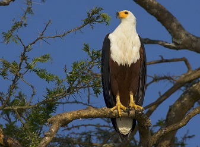

**African Fish Eagle（非洲鱼鹰）(Haliaeetus vocifer)**
标志性白头，鸣声嘹亮。

African fish eagle is a large species of eagle with a mostly brown body and large powerful, black wings. The head, breast, and tail of are snow white, with the exception of the featherless face, which is yellow. These birds are found throughout sub-Saharan Africa wherever large bodies of open water occur that have an abundant food supply. Fish eagles are famously known for their distinct calls, which are often heard before the birds can be seen. In Kenya you'll mostly find these birds in Lake Baringo and Masai Mara Game Reserve.

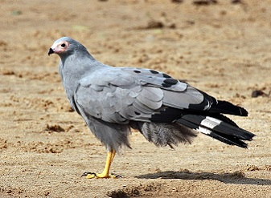

**African Harrier Hawk（非洲鹞雕）(Polyboroides typus)**
能攀爬取卵，适应城市林地。

African Harrier-Hawk is a medium-sized raptor, that is commonly found in areas that have more than 300mm of annual rain. The plumage is mostly brown with pale steaks on the head, breast and forewings. The belly is white with fine dark barring. The broad wings are pale grey with a black trailing edge fringed with a narrow white line. The tail is black with a single broad white band. Sexes are similar, but young birds have pale brown instead grey, and dark brown replacing black. It can be found in natural woodland, tree plantations and urban areas. Best places to spot this bird is Lake Nakuru National Park and Masai Mara Game Reserve.

**African Openbill Stork（非洲开嘴鹳）(Anastomus lamelligerus)**
上下喙不合，食螺为主。

The african openbill is medium-sized stork bird, found in the sub-Saharan Africa. It is a species of stork in the family of Ciconiidae. It is a stork 80–94 cm long with a weight of 1–1.3 kg. Its adult plumage is generally black with purple and green iridescent highlights. The bill is brownish and notably large. The legs are black and the eye is grey. The juvenile plumage is more dull and brown, with areas of pale feather tips. African openbill feeds almostly exclusively on aquatic snails and freshwater mussels.

**African Spoonbill（非洲琵鹭）(Platalea alba)**
匙形喙扫食浅水。

African Spoonbill is a long-legged wading bird, that lives in marshy wetlands with some open shallow water and nests in colonies in trees or reedbeds. Its body is predominantly white, except for its red legs, face, and bill. This bird can be easily recognised by its uniquely spoon-shaped bill. Both the male and female birds are similar in appearance. The African Spoonbill's diet consists mainly of fish and aquatic invertebrates such as crustaceans or shellfishes, insects, larvae, and mollusks. These birds are commonly found in several of countries in the southern part of Africa and can be spotted in Masai Mara Game Reserve, Kenya.

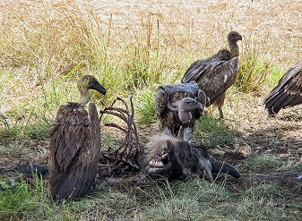

**African White Backed Vulture（白背兀鹫）(Gyps africanus)**
群集食腐，濒危。

African White-backed vulture is the most widespread and common large vulture in Africa. It has a grey neck with a collar of white feathers at the top of their back and their other plumage is various shades of grey. They feed mostly from carcasses of animals and bone fragments. African white backed vultures are highly social and diurnal. They can be found in all Kenya's National Parks and Reserves, one of them being Masai Mara Game Reserve, Kenya. The African White-Backed Vulture is one of a group of 8 species which have long necks that appear to be bald, but that are actually covered in a fine down. This absence of neck feathers allows the vulture to reach deep into a carcass without becoming dirty.

**Bateleur（短尾雕）(Terathopius ecaudatus)**
体型中等，翼短尾短。

The Bateleur is the most famous of the snake eagles, and is a medium-sized, short tailed and colorful species of Eagle. It has a glossy black head, neck, and underparts; a reddish brown back; whitish to red-brown shoulders; a bare red face; and powerful red-orange feet. Bateleurs are endemic to Africa and can be spotted in major national parks and reserves in Kenya.

**Black Chested Snake Eagle（黑胸蛇雕）(Circaetus pectoralis)**
专食蛇类，也捕蜥蝙蝠。

Black Chested Snake Eagle is a large African bird of prey of the family Accipitridae. Is plumage mostly brown with yellow eyes and an unspotted white belly. In flight it has brown-barred white wings. It is widespread in lightly wooded areas of Kenya, but not that commonly spotted. It eats snakes but also lizards and bats. It is easily identified by its dark brown head and chest, to which it owes its name.

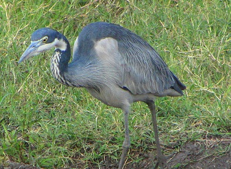

**Black Headed Heron（黑头鹭）(Ardea melanocephala)**
大形鹭类，草原湿地常见。

Black-headed Herons is wading bird of the heron family, it is a large bird, standing 85 cm tall, and it has a 150 cm wingspan. Its plumage is largely grey above, and paler grey below. It has a powerful dusky bill. These birds are common and widespread through much of Africa south of the Sahara, including Masai Mara Game Reserve,Kenya.

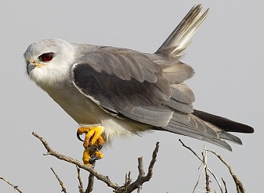

**Black-Winged Kite（黑翅鸢）(Elanus caeruleus)**
悬停猎鼠，广布开阔地。

Black-Winged Kite also known as the black-shouldered kite, is a long-winged raptor, predominantly grey or white with black shoulder patches, wing tips and eye stripe. The sexes are alike in plumage. They are commonly found in open savannah, semi-desert, and agricultural lands with scattered woods; frequently seen on exposed perches and you'll be able to spot them in the Masai Mara, Samburu, and other parks in Kenya. They have varied flight style, hovering like a kestrel or gliding like a harrier with deep wingbeats and raised wings.

**Coqui Francolin（科奎鹌鹑雉）(Francolinus coqui)**
体小地栖，草丛隐蔽。

The Coqui francolin (Peliperdix coqui) is a species of bird in the family Phasianidae. It is a small beautifully-patterned francolin bird with yellow or brown head; reddish brown eyes; grey and yellow bill; black and white throat; yellow legs with white and black stripes underparts. Mainly found in Africa's southern half but is also sparsely present in the western Sahel and Ethiopia. It is believed to be the most widespread francolin in Africa. It is mostly resident throughout its range and can be found in Masai Mara Game Reserve, Kenya.

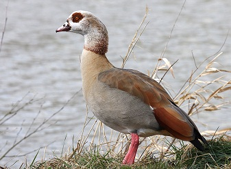

**Egyptian Goose（埃及雁）(Alopochen aegyptiacus)**
面具斑明显，常成对活动。

The Egyptian Goose have long necks, long pink legs, a pink bill and brown eye patches encircling each eye. They are easily identified by a brown patch in the middle of the chest. It eats grasses, seeds, and leaves. Occasionally, it will eat locusts, worms, or other small animals. It is actually part of the shelduck family and pairs for life. These birds are very common in Masai Mara Game Reserve, Kenya.

**Fischer's Sparrow Lark（费氏麻雀百灵）(Eremopterix leucopareia)**
短草地常见，小型百灵。

Fischer's sparrow-lark is a species of passerine bird in the family Alaudidae. It can be distinguished from the similar chestnut-headed sparrow-lark by the absence of a white patch on the crown of its head. This inconspicuous dull-coloured bird is found on short grass plains and its natural habitat is subtropical or tropical dry lowland grassland. Best places to spot this bird includes Nairobi National Park and Northern Masai Mara Game Reserve, Kenya.

**Green Wood Hoopoe（绿戴胜）(Phoeniculus purpureus)**
树干探食昆虫，群体活动。

The Green Wood Hoopoe formerly known as red-billed wood hoope, is an insect-eating species. It feeds mainly on the ground, termite mounds, or on tree trunks, and forms flocks outside the breeding season. Its specialised claws enable it to cling easily to the underside of branches while closely inspecting the bark for insects. The bird has red feet and a long, decurved, red-orange bill and flies heavily, with the long floppy, white-tipped tail dangling behind. It is a common resident breader in Lake Baringo and Masai Mara Game Reserve, Kenya.

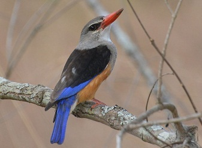

**Grey Headed Kingfisher（灰头翠鸟）(Halcyon leucocephala)**
离水捕虫捕蜥，色彩鲜明。

The Grey-headed Kingfisher has a grey head and chest, coppery belly, blue wing and bright red bill. Unlike many other kinds kingfishers, this large, striking bird hunts away from water catching large insects and small reptiles instead like lizards. These birds lives in dry woodlands, usually near a river or lake and can be found throughout Africa.

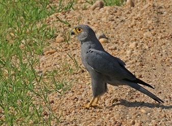

**Grey Kestrel（灰隼）(Falco ardosiaceus)**
体型小，栖居稀树草原。

The grey kestrel is a fairly small, stocky kestrel with a large, flat-topped head and fairly short wings that don't reach past the tip of the tail when at rest. On the underparts, flight feathers and rectrices are barred pale grey. The large head is slightly paler than the body. The bill is black with yellow cere. The eyes are brown, surrounded by broad bare bright yellow eyering. Legs and feet are yellow too. They inhabits savannas, open woodland and forest clearings and can be found in Masai Mara Game Reserve, Kenya.

**Hamerkop（锤头鹳）(Scopus umbretta)**
头冠似锤，筑巨大巢。

Hamerkop is a medium-sized wading bird measuring 47 – 56 centimetres in length and weighing around 415 – 430 grams. The colour of its plumage is brown and there are hints of iridescent purple on its back. The tail is faintly barred with darker brown. It has a long and flat bill that is slightly hooked at the tip and there is a square, blunt crest on its nape. Their legs and neck are shorter in length compared to other wading birds. Hamerkops prefers wetland habitats and they are abundant around their habitat. These birds can be spotted in major of national parks and reserves in Kenya.

**Hadeda Ibis（哈德达鹮）(Bostrychia hagedash)**
清晨鸣叫嘹亮，常见城郊。

Hadeda ibis also known as Hadada, is a large about 76 cm long, grey-to-partly brown species of ibis. It has stout legs and a typical down-curved bill, the wing coverts are iridescent with a green or purple sheen. It is named for its loud three to four note calls (ha-da-da) uttered in flight especially in the mornings and evenings when they fly out or return to their roost trees. Hadadas can be found in many African countries and throughout open grasslands, savanna and wetlands, as well as urban parks, school fields, green corridors and large gardens.

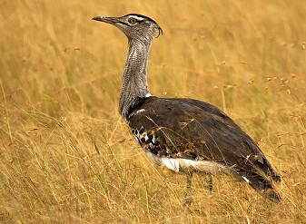

**Kori Bustard（科里鸨）(Ardeotis kori)**
非洲最大飞行鸟之一，地栖。

The kori bustard is arguably the largest flying bird native to Africa. The bird lives on the ground and is reluctant to fly unless in serious danger. Their upper plumage is buff and gray, finely barred with black, which allows them to blend in with their environment. These birds are very common in Kenya particularly in Masai Mara National Reserve and much of Africa in open, semi-arid or seasonally dry habitats. They are usually residential in their range, with some random, nomadic movement following rainfall.

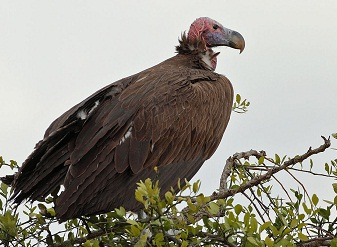

**Lappet Faced Vulture（肉垂兀鹫）(Torgos tracheliotus)**
头颈裸露，力量强大。

Lappet faced vulture sometimes called Nubian vulture, is a scavenging bird, feeding mostly from animal carcasses, which it finds by sight or by watching other vultures. It is easily recognized due its large size, bare pink head and the fleshy folds of skin, called lappets, on each side of its neck. This vulture prefers to live in dry savannah, thornbush, arid plains, deserts with scattered trees in wadis and open mountain slopes. Lappet faced vulture is found in most of Kenya's National parks and reserves including the Masai Mara National Reserve.

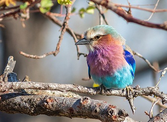

**Lilac Breasted Roller（紫胸佛法僧）(Coracias caudata)**
体色绚丽，喜停枝头。

Lilac-breasted Roller is unofficially considered the national bird of Kenya and is a common sight on tree-tops in almost all national parks. They are african member of the roller family of birds. Widely distributed in sub-Saharan Africa and prefers open woodland and savanna. These colorful little guys eat insects, small rodents, and lizards.

**Marabou Stork（秃鹳）(Leptopilos crumeniferus)**
体型巨，常食腐。

Marabou stork is a large wading, unusual looking bird with hollow legs and toe bones, and is bald-headed. The African Marabou storks reach a wing span of 2.6 metres and a height of 1.5 metres . They are bare, dull and have a red-spotted head with long black legs and massive conical bill. They are mainly dark grey above and white below. They mainly feed on carrion and scraps.

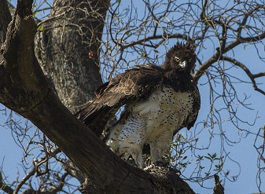

**Martial Eagle（武士雕）(Polemaetus bellicosus)**
大型猛禽，草原顶级掠食者。

The Martial Eagle is Africa’s largest eagle, weighing almost 14 pounds (6.5 kg) and has a wingspan of 2.6 metres. Its plumage is mostly dark grey-brown coloration on the upperparts, head and upper chest, with slightly lighter edging to these feathers. The underparts are white with blackish-brown spotting while the underwing coverts are brown, with pale flight feathers being streaked with black. They are residents of Africa's savanna grasslands, and can be spotted in Masai Mara Game Reserve.

**Ostrich（鸵鸟）(Struthio camelus)**
不会飞，奔跑极快。

The flightless Ostrich is the largest living bird. It has long legs and a long neck that protrudes from a round body. It can grow up to 9 feet (2.7 meters) tall and weighs up to 320 lbs. Although they can't fly, ostrich are fleet, strong runners. They can walk at top speed of up to 43 miles an hour and run over distance at 31 miles an hour. It is widely distributed throughout the savannah plains in Kenya, and is commonly seen in the southern parks and reserves - Masai Mara, Amboseli and Tsavo. Ostrich are classified in the ratite group of birds, all extant species of which are flightless, including the kiwis, emus, and rheas.

**Rufous Naped Lark（棕颈百灵）(Mirafra africana)**
鸣声清脆，开阔地栖。

The rufous-naped lark or rufous-naped bush lark, has a white coloured throat, pink legs and a brown coloured head and back as well as the bill. The eyes are brown. It is a widespread and conspicuous species of lark in the lightly wooded grasslands, open savannas and farmlands of the Afrotropics. They have consistently rufous outer wings and a short erectile crest, but the remaining plumage hues and markings are individually and geographically variable. They can be spotted in Kenyan highlands, Lake Naivasha, Amboseli and Masai Mara Game Reserve.

**Ruppell's Vulture（鲁氏兀鹫）(Gyps rueppellii)**
高空翱翔能手，食腐。

The Ruppell's Vulture is a large vulture that can be found throughout the Sahel region of central Africa. It holds the record as the highest flying bird in the world, with a wingspan of 8 feet. Their plumage is mottled brown or black with a pale brown underside and pale coloured fluff covering their head and neck. They have a white collar at the base of their neck and their crop patch is deep brown. They have excellent eyesight with their eyes coloured yellow or amber. Rüppell's Vultures are scavengers and they feed on the carcasses of dead animals. They can eat the hide and even bones of a carcass.

**Secretary bird（秘书鸟）( Sagittaruis serpentaruis)**
高腿步行猛禽，善捕蛇。

Secretary bird is a long-legged bird with a slender but powerful body 1.2 m long and a 2.1-metre wingspread. It is the only living bird of prey of terrestrial habits,easily recognised by its eagle-like body on crane-like legs with a hooked bill and rounded wings. Endemic to Africa, it is usually found in the open grasslands and savannah of the sub-Saharan region. These birds can be spotted in some parts of Masai Mara Game Reserve, Kenya.

**Southern Ground Hornbill（南方地犀鸟）(Bucorvus leadbeateri)**
地面取食，群居鸣叫洪亮。

Southern Ground Hornbill is the largest species of hornbill on Worlwide. Easily recognized by its jet-black feathers, yellow eyes, and bright red throat. Their sex can be identified by the color of their throats, where the male's is pure red and the female's is a deep violet-blue. These birds lives in open habitats, travels in groups and feeds on insects, small reptiles, and mammals. It's a fun bird to watch if you can spot it.

**Southern Masked Weaver（南方织布鸟）(Ploceus velatus)**
编织悬巢，群栖树上。

The Southern Masked Weaver is 11-14.5 cm long with a short, strong, conical bill and pinkish brown legs. The adult male in breeding plumage has a black face, throat and beak, red eye, bright yellow head and underparts, and a plain yellowish-green back. The female has a pinkish-brown bill, brown or red-brown eye and is dull greenish-yellow, streaked darker on the upper back. The throat is yellowish, fading to off-white on the belly. The non-breeding male resembles the female but retains the red eye. They are found in a wide range of habitats, including shrubland, savanna, grassland, open woodland, inland wetlands and semi-desert areas. These birds are common sight on tree-tops in many of Kenya's national parks/reserves particularly Masai Mara National Reserve.

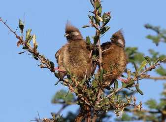

**Speckled Mousebird（斑鼠鸟）(Colius striatus)**
长尾攀援，群体取食果实。

The speckled mousebird is the largest species of mousebird, about 35 cm long, with the tail half its length, and weighs about 57 grams. It is dull-mousy brown in overall color on the back and on the head. The bill is black on the upper part and is a pinkish color on the lower part. It is as one of the most common bird and can be found particularly in Masai Mara National Reserve. It is an active and playful-seeming bird with very long tail and the alert crest make them fun to watch.

**Spotted Thick Knee（斑厚膝鸻）(Burhinus capensis)**
夜行隐蔽，草地难察。

The spotted thick-knee is a medium sized bird, stands about 45 cm in height and weighs between 365 - 450 gram. It has long legs and brown-and-white speckled plumage which provides camouflage, making it difficult to spot the bird in the grasslands and savannas where it roams. The spotted thick-knee is nocturnal and squats on the ground during the daytime, making it difficult to spot. The birds are capable of flying but perefer walking. They hunts exclusively on the ground, feeding on insects, small mammals and lizards. These birds can be found in Masai Mara National Reserve, Kenya.

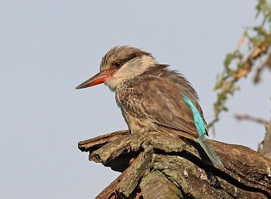

**Striped Kingfisher（条纹翠鸟）(Halcyon chelicuti)**
体小条纹淡雅，林缘栖息。

The Striped Kingfisher is the smallest and least colourful of the non-aquatic kingfishers with powder-blue tail and flight feathers, creamy collar, dark eye-stripe, and streaky brown crown. It is common in the dry bush and open woodlands, especially around the Masai Mara.

**Superb Starling（丽色椋鸟）(Lamprotornis superbus)**
羽色金属光泽，群居常见。

The Superb Starling is a small but distinctive bird, with iridescent blue-to-green back, upper breast, wings, and tail. The adult head is black, the belly is red-orange and the undertail coverts and the wing linings are white. The superb starling has a long hollow bill. They are very conspicuous birds of open disturbed habitats. Commonly found in East Africa and if you're in Kenya, it's very likely you'll see their colorful body punctuated by a white breast band.

**Usambiro Barbet（乌桑比罗拟啄木鸟）(Trachyphonus usambiro)**
体小色艳，啄食果虫。

Usambiro barbet is 18-19 cm long and weighs 37–50.5 g . The head is yellow with black spots and the wings are black with white spots. The breast is also yellow with a dark breast band. The belly is pale yellow with a reddish vent. It is a subspecies of bird in the African barbet family Lybiidae. Mainly found in southern Kenya and northern Tanzania, and can be spotted in Maasai Mara National Reserve and Serengeti National Park. The species inhabits open areas including savannah, grassland, shrubland and pastures. Mainly feeds on seeds, fruit and a wide range of insects. Read more about [Serengeti Animals](https://www.serengetinationalpark.travel/animals-wildlife.php) here.

**Vulturine Guineafowl（秃鹫珠鸡）(Acryllium vulturinum)**
蓝颈披羽，群体奔走。

Vulturine Guineafowl is the largest extant species of guineafowl and has a longer wings, neck, legs and tail than other guineafowl. It is a stunning bird, with a gorgeous body and typically "homely" looking bald head. It eats seeds, worms, and insects. Common in Kenya's National Parks and Reserves including Samburu and Masai Mara National Reserve and Tsavo East National Park.
